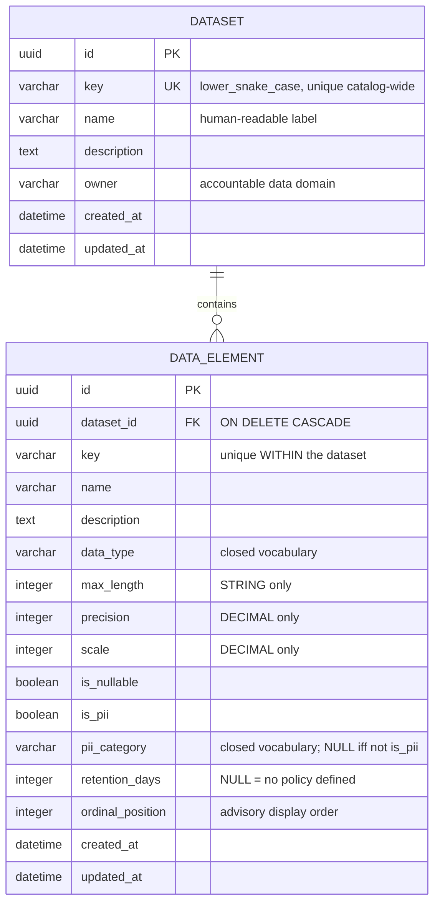

# Dataset Metadata Service

A small REST API for managing **metadata about data**: the datasets a business
owns (`Customer`, `Order`, etc.) and the data elements inside them (`email`,
`date_of_birth`, etc.), together with their logical types, PII classification and
retention policy.

Built with Django 5.2 LTS, Django REST Framework and SQLite.

---

## Quickstart

Requires [uv](https://docs.astral.sh/uv/) and Python 3.12+.

```bash
uv sync                                   # create .venv and install dependencies
uv run python manage.py migrate           # create the SQLite database
uv run python manage.py runserver
```

Then open **<http://localhost:8000/api/v1/docs/>** for the Swagger UI.

```bash
uv run pytest                             # 34 tests
uv run pytest --cov=metadata_catalog      # with coverage
uv run ruff check . && uv run ruff format --check .
```

---

## API

Base path `/api/v1/`.

| Method | Path | Purpose |
| --- | --- | --- |
| `GET` | `/datasets/` | List datasets (with element counts) |
| `POST` | `/datasets/` | Create a dataset |
| `GET` | `/datasets/{id}/` | Retrieve a dataset **with its data elements** |
| `GET` | `/datasets/{id}/elements/` | List a dataset's data elements |
| `POST` | `/datasets/{id}/elements/` | Add a data element to a dataset |
| `GET` | `/datasets/{id}/elements/{id}/` | Retrieve one data element |
| `PUT` / `PATCH` | `/datasets/{id}/elements/{id}/` | Update a data element |
| `DELETE` | `/datasets/{id}/elements/{id}/` | Delete a data element |
| `GET` | `/schema/` | OpenAPI 3 schema |
| `GET` | `/docs/` | Swagger UI |

Data elements are nested under their dataset because an element has no identity
of its own - the URL states the ownership that the model enforces with a
cascading foreign key. Requesting an element under the wrong dataset returns
`404`, not another dataset's data.

### The list is shallow, the detail is deep

`GET /datasets/` returns a `data_element_count` rather than the elements
themselves. Embedding every element in every list row is an unbounded response.
The count comes from a queryset annotation, not a per-row `.count()`, so listing
datasets costs the same number of queries whether there are 1 or 1000 (there is
a test for this).

### Example

```bash
curl -X POST localhost:8000/api/v1/datasets/ -H 'Content-Type: application/json' -d '{
  "key": "customer", "name": "Customer", "owner": "retail-data-domain",
  "description": "Master data for retail banking customers."
}'

curl -X POST localhost:8000/api/v1/datasets/$DS/elements/ -H 'Content-Type: application/json' -d '{
  "key": "email", "name": "Email address", "data_type": "STRING", "max_length": 320,
  "is_pii": true, "pii_category": "CONTACT", "retention_days": 2555
}'
```

```jsonc
// GET /api/v1/datasets/{id}/
{
  "id": "1f0a3c2e-9b41-4d6a-8c17-0e5f2a7b1d33",
  "key": "customer",
  "name": "Customer",
  "owner": "retail-data-domain",
  "data_element_count": 2,
  "data_elements": [
    {
      "key": "email",
      "name": "Email address",
      "data_type": "STRING",
      "type_signature": "STRING(320)",
      "max_length": 320, "precision": null, "scale": null,
      "is_nullable": true,
      "is_pii": true,
      "pii_category": "CONTACT",
      "retention_days": 2555,
      "ordinal_position": 1
    },
    {
      "key": "account_balance",
      "data_type": "DECIMAL",
      "type_signature": "DECIMAL(18,2)",
      "max_length": null, "precision": 18, "scale": 2,
      "is_pii": false, "pii_category": null,
      "ordinal_position": 2
    }
  ]
}
```

### Filtering, search, ordering and paging

| Endpoint | Parameters |
| --- | --- |
| `/datasets/` | `owner`, `search`, `ordering`, `page` |
| `/datasets/{id}/elements/` | `is_pii`, `data_type`, `pii_category`, `search`, `ordering`, `page` |

```bash
# Every piece of personal data in a dataset — the question this catalog exists to answer
curl "localhost:8000/api/v1/datasets/$DS/elements/?is_pii=true"

# Filters AND together
curl "localhost:8000/api/v1/datasets/$DS/elements/?is_pii=true&data_type=STRING"

# search is a case-insensitive substring of key, name or description
curl "localhost:8000/api/v1/datasets/$DS/elements/?search=euros"
```

`data_type` and `pii_category` are `ChoiceFilter`s, so `?data_type=BANANA`
returns `400` rather than an empty list. A typo in the vocabulary is an error,
not a misleading result. All filter parameters appear in the OpenAPI schema
automatically.

---

## Data model



---

## Design decisions

### 1. How datasets and data elements are modelled

**A `key` and a `name` are different things.** `key` is the machine-readable
identifier (`date_of_birth`) that pipelines and downstream systems join on;
`name` is the label a human reads ("Date of birth"). Collapsing them into one
field means either the identifier is unstable or the label is unreadable.

**Composition, not association.** `DataElement.dataset` is a non-nullable
foreign key with `ON DELETE CASCADE`. A data element describes a field *of* a
dataset; it has no meaning without one, and it should not outlive it. That is a
statement about the domain, expressed in the schema rather than in a comment.

**Uniqueness is scoped, deliberately.** `Dataset.key` is unique across the whole
catalog, because a dataset *is* the top-level namespace. `DataElement.key` is
unique only within its dataset — `email` may exist in both `customer` and
`order`, and treating those as a collision would be wrong. This is enforced as
`UNIQUE (dataset_id, key)` and is the rule most of the tests are built around.

**UUID primary keys.** Non-enumerable in URLs, and a client can generate an id
before the round trip. The cost is a wider index and less readable URLs than a
natural key like `/datasets/customer/` would give. That alternative is arguably
nicer for a catalog, but it couples the URL to a mutable field; UUIDs keep the
key free to change later.

**Additional fields beyond the brief.** `owner` (governance needs an accountable
party), `is_nullable`, `is_pii` / `pii_category`, `retention_days` and
`ordinal_position`.

### 2. Which constraints are enforced at the database level

Every business rule is a real constraint in the schema, not a check in the
serializer. `uv run python manage.py sqlmigrate metadata_catalog 0001` prints
the DDL.

| Constraint | Level | Rule |
| --- | --- | --- |
| `dataset.key UNIQUE` | **DB** | Dataset keys are unique across the catalog |
| `unique_data_element_key_per_dataset` | **DB** | Element keys are unique *within* a dataset |
| `data_element_data_type_valid` | **DB** | `data_type` is in the closed vocabulary |
| `data_element_pii_category_valid` | **DB** | `pii_category` is in the closed vocabulary, or NULL |
| `data_element_pii_category_matches_is_pii` | **DB** | PII flag and category are a biconditional |
| `data_element_max_length_only_for_string` | **DB** | `max_length` required for `STRING`, forbidden otherwise |
| `data_element_precision_scale_only_for_decimal` | **DB** | `precision`+`scale` required for `DECIMAL`, forbidden otherwise |
| `data_element_scale_within_precision` | **DB** | `scale <= precision` |
| `data_element_retention_days_positive` | **DB** | `>= 1` when set |
| `data_element_ordinal_position_positive` | **DB** | `>= 1` |
| `dataset_id` FK `ON DELETE CASCADE` | **DB** | Elements do not outlive their dataset |
| `key` format `^[a-z][a-z0-9_]*$` | **Application only** | See trade-offs |

Two details worth naming rather than hiding:

- `choices=` on a Django field is **Python-only validation**. A management
  command, data migration or `bulk_create` bypasses it entirely. The two
  vocabulary `CHECK` constraints are what make the enums real.
- `PositiveIntegerField` emits its own `CHECK (... >= 0)` on top of the
  `>= 1` constraints. Mildly redundant, harmless, and left in place because the
  field type documents intent.

### 3. How data types are represented

A data element's type is a **closed enum plus optional parameters**, with each
parameter legal only for the type that defines it.

```
data_type   STRING | INTEGER | DECIMAL | BOOLEAN | DATE | DATETIME | UUID
max_length  required for STRING,  must be NULL for everything else
precision   required for DECIMAL, must be NULL for everything else
scale       required for DECIMAL, must be NULL for everything else
```

Both rules are `CHECK` constraints, so `UUID(320)` and `BOOLEAN(18,2)` are
unrepresentable rather than merely discouraged.

The API also exposes a read-only `type_signature` (`STRING(320)`,
`DECIMAL(18,2)`), derived as a model property rather than stored — storing it
would create a second source of truth for something computable from three
columns.

**Alternatives considered:**

- *A free-text `data_type` column.* Maximum flexibility, no validation, and the
  registry loses its whole purpose: `varchar`, `VARCHAR`, `string` and `str`
  become four different types and nothing is comparable across datasets.
  Rejected.
- *A `DataType` lookup table.* Types become user-extensible at runtime without a
  migration. But validating *which parameters apply to which type* moves back
  into application code, and the vocabulary stops being enforceable in the
  schema. Rejected at this scope; it is the right change if the catalog ever
  needs to ingest types it does not know about (Avro maps, nested structs).

Types here are **logical, not physical**: the catalog records what a field
*means*, not how any particular database stores it.

### 4. How validation is handled

Each rule is declared **once**, in `Meta.constraints`, and serves three layers:

| Layer | Mechanism |
| --- | --- |
| Request shape | DRF fields derived from the model (types, lengths, choices, regex) |
| Business rules | `instance.full_clean()` in `DataElementSerializer.validate()`, which evaluates the model's own constraints |
| Last line of defence | The `CHECK` and `UNIQUE` constraints in the schema |

Two things this avoids:

**No duplicated rules.** An earlier draft of the serializer restated the type
and PII rules in Python. It had already drifted from the model on the day it was
written — the constraints require `max_length >= 1` and `retention_days >= 1`,
the Python copy only checked for `None`, so `max_length: 0` passed validation
and produced a `500` from the database. Delegating to `full_clean()` removed
that whole class of bug.

**No `IntegrityError` reaching the client.** DRF surfaces `UniqueConstraint`
automatically (including the `violation_error_message` declared on it) but knows
nothing about `CheckConstraint`, so without `full_clean()` seven of the ten
rules would return `500` instead of `400`.

Partial updates are validated against the **merged** element, not the patch
body. `PATCH {"data_type": "DATE"}` on a `STRING` element is rejected, because
the element would still be carrying a `max_length` afterwards;
`PATCH {"data_type": "DATE", "max_length": null}` succeeds.

`dataset` is a `HiddenField` fed from the URL rather than being omitted from the
serializer. This is not cosmetic: DRF **silently drops** the
`UniqueTogetherValidator` for `(dataset, key)` if `dataset` is not a serializer
field, which would turn the headline business rule into a `500`.

---

## Testing

```bash
uv run pytest                           
uv run pytest --cov=metadata_catalog
```

| File | Covers |
| --- | --- |
| `test_datasets_api.py` | Dataset create / list / retrieve, key validation, query counts |
| `test_data_elements_api.py` | Element CRUD, ordinals, business rules, dataset scoping |
| `test_filtering.py` | Filters, search, invalid filter values |
| `test_model_constraints.py` | The same rules with the API bypassed |

Every test follows Arrange / Act / Assert and carries a one-line docstring
stating what it proves.

The tests worth looking at first:

- **`test_database_rejects_a_duplicate_key_when_the_api_is_bypassed`** — writes
  through the ORM directly. This is what proves the rule is in the schema rather
  than in request handling.
- **`test_the_same_key_in_a_different_dataset_is_allowed`** — proves the
  constraint is *scoped*, which a global unique index would break.
- **`test_listing_datasets_does_not_run_more_queries_as_datasets_are_added`** —
  captures the query count with 1 dataset and again with 6 and asserts they are
  equal. No magic number to break, and it pins the annotation against someone
  reintroducing an N+1.
- **`test_patch_validates_the_element_that_would_result`** — partial updates are
  checked against the merged element.

### What testing caught

`STRING` without a `max_length` was being **accepted**, by the database *and* by
`full_clean()`. The constraint read:

```sql
CHECK ((data_type = 'STRING' AND max_length >= 1)             -- TRUE AND NULL  = NULL
    OR (NOT (data_type = 'STRING') AND max_length IS NULL))   -- FALSE AND TRUE = FALSE
-- NULL OR FALSE = NULL, and a SQL CHECK only fails on FALSE
```

SQL three-valued logic: a `CHECK` that evaluates to `NULL` passes. The `DECIMAL`
equivalent escaped this by accident, because its `scale IS NOT NULL` term
resolves to `FALSE` and poisons the whole `AND`. Adding an explicit
`max_length IS NOT NULL` term fixed it. Worth recording as the failure mode you
inherit when you move rules into SQL — and as the reason the negative cases are
worth testing.

---

## Assumptions

- **No authentication or authorisation.** The service is assumed to sit behind
  a gateway that handles identity. `AllowAny` is set explicitly rather than left
  to the default, so it reads as a decision.
- **No multi-tenancy.** `owner` is a free-text domain name, not a foreign key to
  an organisation.
- **Keys are stable identifiers.** They may be changed, but nothing in the
  system treats a rename as a versioned event.
- **No schema evolution or history.** The catalog records the current shape of a
  dataset, not how it changed over time.
- **SQLite stands in for PostgreSQL.** Nothing in the model depends on SQLite;
  see the trade-off below for the one place the choice is visible.

## Trade-offs

- **The `key` format is enforced in Python only.** SQLite cannot use a regex in
  a DDL `CHECK`, so `Dataset.objects.create(key="Customer")` succeeds through
  the ORM even though the API rejects it. On PostgreSQL this becomes
  `CHECK (key ~ '^[a-z][a-z0-9_]*$')` and the gap closes. A SQLite `GLOB` check
  would cover most of it, but only approximately, so I preferred one honest
  empty cell in the constraint table over a partial rule that looks complete.

- **`ordinal_position` is advisory and not unique.** Making it unique per
  dataset would mean renumbering every following element on an insert, and
  SQLite cannot defer a unique check to commit time. Ordering therefore falls
  back to `key` as a deterministic tie-breaker, so pagination stays stable even
  when two elements share an ordinal.

- **Constraint violations report as `non_field_errors`.** The message names the
  field, but routing each violation to its own field would need a
  code-to-field map. At this size the indirection costs more than it returns.

- **A duplicate key returns `400`, not `409`.** `409 Conflict` is arguably more
  precise, since a duplicate is a conflict with existing resource state rather
  than a malformed body. `400` is what DRF gives for free and it keeps a single
  error shape across the API. A custom exception handler would be the change.

- **Datasets have no update or delete endpoint.** The brief asks for create,
  list and retrieve, and those are implemented. Elements get full CRUD because
  the brief asks for them to be *managed*. Deleting a dataset would cascade to
  its elements, which for a governance catalog probably deserves an explicit
  confirmation rather than being a one-liner.

- **`is_pii` and `pii_category` are a strict biconditional.** Clearing the flag
  requires clearing the category in the same request. Slightly more work for a
  client, but it makes uncategorised PII and orphaned classifications both
  unrepresentable, which is the point.

- **Dependencies are declared as compatible ranges** in `pyproject.toml` and
  resolved by `uv`. `uv.lock` captures the exact transitive set.

---

## Project layout

```
config/                     settings, root URLconf
metadata_catalog/
├── models/
│   ├── dataset.py          Dataset
│   └── data_element.py     DataElement, DataType, PiiCategory, constraints
├── utils/validators.py     shared key format, so the two models cannot drift
├── serializers.py          request/response shapes and validation delegation
├── filters.py              query parameters for both list endpoints
├── views.py                generic views; querysets tuned to avoid N+1
├── urls.py                 nested routes
└── tests/                  34 tests
```
